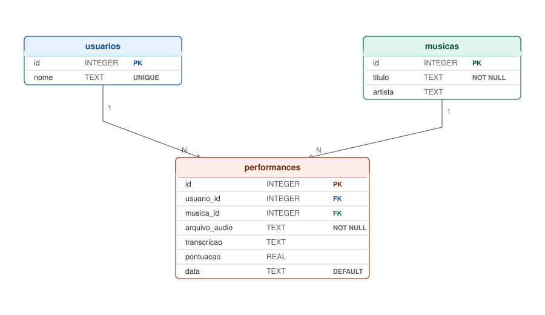

# SingAI --- Karaokê Inteligente

Documentação do projeto: como configurar o ambiente, rodar o servidor e
o que já foi feito até agora.

------------------------------------------------------------------------

## 1. Estrutura de pastas do projeto

    singai/
    ├── venv/                  → ambiente virtual Python (não mexer manualmente)
    ├── main.py                → backend (FastAPI) com todas as rotas
    ├── database.py            → funções de acesso ao banco de dados (SQLite)
    ├── singai.db              → arquivo do banco de dados (criado automaticamente)
    ├── importar_musicas.py    → script que popula a tabela `musicas` a partir de musicas/ e letras/
    ├── musicas/                → MP3s originais do catálogo (as músicas em si, não as gravações)
    ├── audios/                → áudios gravados pelos usuários
    ├── letras/                → letras de referência de cada música (.txt)
    ├── docs/
    │   └── database-schema.svg → diagrama do banco de dados (usado no README)
    └── static/
        ├── index.html          → estrutura da interface
        ├── style.css           → visual (cores, layout)
        └── app.js              → lógica da interface (gravação, catálogo, modal)

> **Atenção pra não confundir:** `musicas/` guarda os MP3 originais do catálogo (o que a pessoa vai cantar em cima); `audios/` guarda as gravações que os próprios usuários fazem ao cantar. São pastas diferentes, apesar do nome parecido.

------------------------------------------------------------------------

## 2. Como ativar o ambiente e rodar o servidor

Sempre que for trabalhar no projeto, siga esses passos, nesta ordem:

``` bash
cd ~/singai
source venv/bin/activate
uvicorn main:app --reload
```

-   `cd ~/singai` → entra na pasta do projeto.
-   `source venv/bin/activate` → ativa o ambiente virtual (o terminal
    passa a mostrar `(venv)` no início da linha --- é assim que você
    confirma que está ativado).
-   `uvicorn main:app --reload` → sobe o servidor. Ele carrega o modelo
    Whisper na inicialização, então pode demorar alguns segundos até
    aparecer `Application startup complete`.

Depois disso, acessar no navegador:

    http://127.0.0.1:8000/static/index.html   → interface principal
    http://127.0.0.1:8000/docs                → documentação/teste manual das rotas da API

Para parar o servidor: `Ctrl + C` no terminal onde ele está rodando.

**Importante:** o venv precisa ser ativado (`source venv/bin/activate`)
toda vez que abrir um terminal novo --- essa ativação não é permanente,
vale só para aquela sessão do terminal.

------------------------------------------------------------------------

## 3. Dependências instaladas

Instaladas dentro do venv com `pip install`:

  -----------------------------------------------------------------------
  Pacote                              Para que serve
  ----------------------------------- -----------------------------------
  `fastapi`                           Framework do backend

  `uvicorn`                           Servidor que roda a aplicação
                                      FastAPI

  `python-multipart`                  Necessário para receber upload de
                                      arquivos (áudio)

  `openai-whisper`                    Transcrição de voz para texto

  `jiwer`                             Cálculo do WER (Word Error Rate),
                                      usado na pontuação
  -----------------------------------------------------------------------

Também é necessário ter o **ffmpeg** instalado no sistema (não é pacote
Python):

``` bash
sudo apt install ffmpeg
```

Se precisar reinstalar tudo do zero em outra máquina:

``` bash
cd ~/singai
python3 -m venv venv
source venv/bin/activate
pip install fastapi uvicorn python-multipart openai-whisper jiwer
```

------------------------------------------------------------------------

## 4. Rotas da API (backend)

  -----------------------------------------------------------------------
  Rota                    Método                  O que faz
  ----------------------- ----------------------- -----------------------
  `/`                     GET                     Só confirma que o
                                                  backend está rodando

  `/static/index.html`    GET                     Serve a interface web

  `/musicas`              GET                     Lista os ids das
                                                  músicas disponíveis
                                                  (baseado nos arquivos
                                                  `.txt` em `letras/`)

  `/gravar`               POST                    Recebe um arquivo de
                                                  áudio e salva em
                                                  `audios/`

  `/transcrever`          POST                    Transcreve um áudio já
                                                  salvo, usando Whisper
                                                  (parâmetro:
                                                  `nome_arquivo`)

  `/pontuar`              POST                    Transcreve o áudio,
                                                  compara com a letra da
                                                  música e calcula a
                                                  pontuação (parâmetros:
                                                  `nome_arquivo`,
                                                  `musica_id`, `usuario`)

  `/historico`            GET                     Lista as últimas
                                                  performances registradas
                                                  (parâmetros opcionais:
                                                  `usuario`, `limite`,
                                                  padrão 5)
  -----------------------------------------------------------------------

**Detalhes importantes do `/pontuar`:** - Atualmente usa o modelo Whisper `"medium"` com `language="pt"`, usando o português como idioma inicial do projeto. - Futuramente, quando o projeto passar para um modelo maior, o tamanho do modelo poderá ser alterado e o parâmetro de idioma poderá deixar de ficar fixo em português, permitindo trabalhar com outros idiomas. - Antes de calcular o WER, o texto é normalizado (letras minúsculas, sem pontuação) para que maiúsculas/vírgulas não prejudiquem a pontuação injustamente. - A pontuação é calculada como `(1 - WER) * 100`, arredondada em 2 casas decimais.

------------------------------------------------------------------------

## 5. Banco de dados

Criado com SQLite (não precisa de MySQL nem instalação de servidor — é só um arquivo `singai.db` na pasta do projeto).

O banco é relacional: existem três tabelas, com `usuarios` e `musicas` sendo referenciadas por `performances` através de chave estrangeira. Isso evita repetir/duplicar nome de usuário ou título de música a cada performance salva.



### 5.1 Tabela `usuarios`

| Coluna | Tipo | Descrição |
|---|---|---|
| `id` | INTEGER | Chave primária, autoincremento |
| `nome` | TEXT | Nome de quem canta (único — não permite duplicar) |

### 5.2 Tabela `musicas`

| Coluna | Tipo | Descrição |
|---|---|---|
| `id` | INTEGER | Chave primária, autoincremento |
| `titulo` | TEXT | Título da música |
| `artista` | TEXT | Artista (opcional) |
| `caminho_audio` | TEXT | Caminho do MP3 original em `musicas/` |
| `caminho_letra` | TEXT | Caminho do `.txt` da letra em `letras/` (pode ficar em branco até a letra ser adicionada) |

### 5.3 Tabela `performances`

Registra cada vez que um usuário canta uma música:

| Coluna | Tipo | Descrição |
|---|---|---|
| `id` | INTEGER | Chave primária, autoincremento |
| `usuario_id` | INTEGER | Chave estrangeira → `usuarios.id` |
| `musica_id` | INTEGER | Chave estrangeira → `musicas.id` |
| `arquivo_audio` | TEXT | Nome do arquivo salvo em `audios/` |
| `transcricao` | TEXT | Texto transcrito pelo Whisper |
| `pontuacao` | REAL | Nota calculada (0 a 100) |
| `data` | TEXT | Data/hora do registro (preenchida automaticamente) |

### 5.4 Funções em `database.py`

- `criar_tabelas()` — cria as três tabelas (chamada automaticamente quando o servidor sobe, via evento de `startup` do FastAPI).
- `buscar_ou_criar_usuario(nome)` / `buscar_ou_criar_musica(titulo, artista)` — procuram o registro pelo nome/título e retornam o `id`; se não existir, criam antes de retornar. É assim que se evita duplicar usuário/música.
- `salvar_performance(usuario, musica_titulo, arquivo_audio, transcricao, pontuacao, artista=None)` — resolve os IDs de usuário e música por trás dos panos (chamando as duas funções acima) e insere a performance.
- `listar_historico(usuario=None, limite=10)` — retorna o histórico já com `JOIN`, trazendo o nome do usuário e o título da música em vez dos IDs.

### 5.5 Importação do catálogo (`importar_musicas.py`)

Script separado (fora do `main.py`) que popula a tabela `musicas` a partir das pastas `musicas/` (MP3s) e `letras/` (`.txt`):

- Varre `musicas/`, casa cada MP3 com o `.txt` de mesmo nome em `letras/`.
- Se a letra ainda não existir, importa a música mesmo assim com `caminho_letra` em branco.
- Roda quantas vezes for preciso: pula o que já está no banco e completa `caminho_letra` das músicas que ganharam letra depois.
- Uso: `python importar_musicas.py`, com o venv ativado, na raiz do projeto.

A integração com a pontuação já foi realizada: `salvar_performance()` é usado para registrar os resultados das performances. Ao escolher uma música, a interface pede o nome do usuário de forma simples e esse nome é salvo junto com o resultado. O painel **Últimas músicas** já mostra a porcentagem de acerto e o usuário que realizou cada performance.

> **Nota sobre nomenclatura:** o `musica_id` que circula pelo `main.py` e pelo `app.js` (parâmetro das rotas, nome de arquivo de áudio) é, na prática, o *slug* do arquivo de letra (ex: `"dom_quixote"`), não o `id` numérico da tabela `musicas`. São dois conceitos com nome parecido — vale ter isso em mente ao mexer no código.

**Próximos passos do banco:**
- Continuar expandindo as consultas e funcionalidades do histórico conforme o projeto evoluir.
- Avaliar se vale a pena unificar a nomenclatura de `musica_id` (slug) com o `id` real da tabela `musicas`, pra evitar confusão futura.

> **Importante:** o banco `singai.db` não substitui as pastas `audios/` e `letras/`. O banco registra informações sobre as performances e os nomes/identificadores dos arquivos, mas os arquivos físicos continuam sendo utilizados pelo sistema.


## 6. Catálogo de músicas

Até o momento, o catálogo tem **15 músicas** com áudio em `musicas/`,
sendo que **14 já têm letra** correspondente em `letras/` (falta 1
letra ainda).

Cada música precisa de um MP3 em `musicas/` e, idealmente, um `.txt`
com a letra em `letras/`, ambos com o **mesmo nome de arquivo**
(minúsculo, sem espaço, use `_` no lugar de espaço) — esse nome é o
mesmo id usado pela rota `/musicas` e pelos áudios.

Pra colocar essas músicas no banco (tabela `musicas`), roda o script de
importação em vez de editar o banco na mão:

``` bash
python importar_musicas.py
```

Ele lê o que tem em `musicas/` e `letras/` e insere/atualiza a tabela
`musicas` sozinho — inclusive a música que ainda não tem letra, que
fica registrada com `caminho_letra` em branco até o `.txt` chegar.

**Ainda faltando:** a letra da música que falta e sincronizar letra +
música por tempo (ver item 10).

------------------------------------------------------------------------

## 7. Interface web

-   Layout tipo dashboard: sidebar de navegação, catálogo de músicas em
    cards, painel direito com atalhos e histórico, e um modal que abre
    para gravar.
-   Paleta de cores clara e vibrante: fundo bege (`#EFE6D8`) com blobs
    decorativos coloridos (coral, amarelo, turquesa, verde-limão) nos
    cantos, painéis internos em off-white quente (`#FFFCF5`), cards de
    música com gradientes coloridos variados.
-   Logo "SingAI" com fonte arredondada (Google Fonts "Baloo 2"), "Sing"
    em preto e "AI" com efeito de gradiente colorido no texto.
-   Ícones em SVG simples (sem emojis), em preto para bom contraste.
-   Capa de cada música no catálogo: mostra a primeira letra do nome
    (sem precisar de imagens com direitos autorais).
-   Gravação de áudio feita direto pelo microfone do navegador
    (`MediaRecorder`), funciona também em tablets/celulares acessando
    pelo navegador --- inclusive com microfone físico de fio via
    adaptador, se for o caso.

------------------------------------------------------------------------

## 8. Decisões já tomadas (para não esquecer o "porquê")

-   **MVP primeiro, CREPE depois:** construir o fluxo completo de texto
    (Whisper + comparação com a letra) antes de somar a avaliação de
    afinação com CREPE, para não sobrecarregar o prazo escolar.
-   **Interface web, não app nativo:** mesmo cogitando rodar num tablet,
    a interface web funciona igual (inclusive microfone de fio) e evita
    todo o trabalho extra de configurar ambiente de desenvolvimento
    mobile.
-   **SQLite em vez de MySQL:** suficiente para o uso local e a escala
    do projeto escolar, sem precisar instalar/configurar um servidor de
    banco separado.
-   **Git/GitHub para trabalhar em dupla:** escolhido em vez de
    sincronização automática de pasta (tipo Syncthing), por dar controle
    de versão e evitar perda de trabalho quando os dois mexem no
    projeto.

------------------------------------------------------------------------

## 9. Trabalhando em dupla com Git/GitHub

Repositório do projeto: `https://github.com/MariaClaraAlvs/singai`

### 9.1 Configuração inicial (uma vez por pessoa/computador)

``` bash
git config --global user.name "Seu Nome"
git config --global user.email "seu-email@exemplo.com"
```

### 9.2 Clonando o projeto (quem ainda não tem a pasta local)

``` bash
git clone https://github.com/MariaClaraAlvs/singai.git
cd singai
python3 -m venv venv
source venv/bin/activate
pip install fastapi uvicorn python-multipart openai-whisper jiwer
```

(o `venv/` não vem no clone, pois está no `.gitignore` --- cada pessoa
cria o seu próprio ambiente local)

### 9.3 Autenticação no GitHub

O GitHub não aceita mais senha normal da conta para
`git push`/`git pull` --- é necessário um **Personal Access Token
(PAT)**: 1. GitHub → foto de perfil → **Settings** → **Developer
settings** → **Personal access tokens** → **Tokens (classic)**. 2.
**Generate new token (classic)**, marcar a opção **repo**, gerar e
copiar o token (só aparece uma vez). 3. Usar esse token no lugar da
senha quando o terminal pedir. 4. Opcional, para não digitar toda vez:
`git config --global credential.helper store`

### 9.4 Rotina de trabalho (seguir sempre nessa ordem)

**Antes de começar a mexer em qualquer coisa:**

``` bash
git pull
```

**Depois de terminar uma alteração (não precisa esperar terminar tudo,
pode ser por partes):**

``` bash
git add .
git commit -m "descrição curta do que mudou"
git push
```

Exemplos de mensagens de commit: `"Adiciona rota de histórico"`,
`"Ajusta cores da interface"`, `"Corrige bug na transcrição"`.

### 9.5 O que fica de fora do Git (`.gitignore`)

    venv/
    __pycache__/
    *.pyc
    .DS_Store

**Atenção:** `singai.db` (banco) e os arquivos de `audios/` e
`musicas/` **entram** no Git normalmente. Como são arquivos binários,
se os dois editarem/gravarem ao mesmo tempo pode dar conflito que
precisa ser resolvido manualmente --- vale avisar um ao outro antes de
mexer nessas partes.

------------------------------------------------------------------------

## 10. Roteiro do que falta (visão geral)

1. Continuar a evolução do banco de dados conforme surgirem novas consultas e necessidades do sistema
2. Adicionar a letra que ainda falta no catálogo (14/15 concluídas)
3. ~~Conseguir os áudios reais cantando cada música~~ — concluído, 15 músicas em `musicas/`
4. Integrar o CREPE para a pontuação de afinação (evolução final, conforme o relatório)
5. Sincronizar a letra e a música para o usuário cantar acompanhando o instrumental
6. Futuramente, avaliar a troca do Whisper `medium` por um modelo maior e permitir outros idiomas retirando a configuração fixa `language="pt"`
